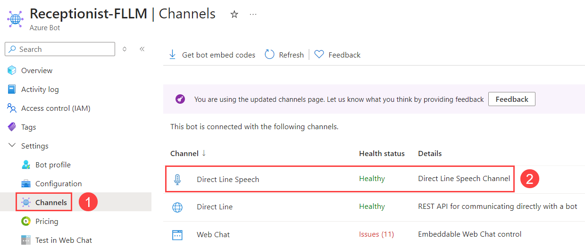

# FLLM-AI-Receptionist

This repository implements a conversational, multi-agent solution with [FoundationaLLM.](https://foundationallm.ai/)

## Demo


## Setup

### Required Tools

- Visual Studio 2022 (Python & ASP.NET Core workloads)
- Python 3.11
- ngrok (local tunneling)

  ngrok configuration file:

  ```
  tunnels:
    bot:
      addr: 5241
      host_header: localhost:5241
      proto: http   
    orchestrator:
      addr: 8765
      proto: http
  ```

### Azure Setup

You must provision the following Azure resources:

- Azure AI Services account
- Azure Bot (F0 is sufficient)
    - The bot must have support for Direct Line Speech.

    

    - This application is configured to use an Entra ID application with a client secret for authentication
    - The bot must call your ngrok endpoint

Create an `.env` file in the Python project, copying the placeholders in the `.env.sample` file.

Create an `appsettings.Development.json` file in the .NET project, copying the placeholders in `appsettings.json`.

### FoundationaLLM Setup

You must be running version 0.7.0+ of FoundationaLLM.

#### Agents

##### Receptionist

The `Receptionist` agent is the main orchestrator, directing requests to the other agents.

Agent Definition:

```json
{
    "type": "knowledge-management",
    "name": "Receptionist",
    "description": "Performs receptionist duties by asking for help from other agents.",
    "display_name": "Receptionist",
    "inline_context": true,
    "vectorization": {
        "indexing_profile_object_id": null,
        "text_embedding_profile_object_id": null
    },
    "sessions_enabled": true,
    "conversation_history": {
        "enabled": true,
        "max_history": 5
    },
    "gatekeeper": {
        "use_system_setting": false,
        "options": []
    },
    "orchestration_settings": {
        "orchestrator": "SemanticKernel",
        "endpoint_configuration": {
            "endpoint": "<OpenAI Endpoint>",
            "api_version": "2024-02-01",
            "auth_type": "token",
            "provider": "microsoft"
        },
        "model_parameters": {
            "deployment_name": "completions"
        }
    },
    "prompt_object_id": "/instances/<Instance Id>/providers/FoundationaLLM.Prompt/prompts/Receptionist"
}
```

Prompt Definition:

```json
{
  "type": "multipart",
  "name": "Receptionist",
  "description": "System prompt for the Receptionist agent",
  "prefix": "You are an agent named The Receptionist that selects the best-suited agents to answer a user question.\nYou must answer based only on the list of agent names and descriptions.\nThe list in the AGENTS section below contains the names and descriptions of available agents.\nConsidering the user question in the USER QUESTION section below, choose the agents whose descriptions indicate they are best suited to help answer the question.\nWhen calling an agent, do NOT omit any information.\nProvide your answer as a list of agent names followed by an agent-specific request, where each agent name is preceded by the @ character.\nHere is an example of a correctly formatted answer:\n\n@agent1, help solve part of the problem.\n@agent2, help solve another part of the problem.\n\nAGENTS\n\n{{agentDescriptions $userPrompt}}\n\nUSER QUESTION\n\n{{$userPrompt}}",
  "suffix": ""
}
```

##### OfficeKnowledge

The `OfficeKnowledge` agent answers generic questions about the office using its Inline Context.

Agent Definition:

```json
{
    "type": "knowledge-management",
    "name": "OfficeKnowledge",
    "description": "Handles any tasks related to generic office information.",
    "display_name": "OfficeKnowledge",
    "inline_context": true,
    "vectorization": {
        "indexing_profile_object_id": null,
        "text_embedding_profile_object_id": null
    },
    "sessions_enabled": true,
    "conversation_history": {
        "enabled": true,
        "max_history": 5
    },
    "gatekeeper": {
        "use_system_setting": false,
        "options": []
    },
    "orchestration_settings": {
        "orchestrator": "LangChain",
        "endpoint_configuration": {
            "endpoint": "<OpenAI Endpoint>",
            "api_version": "2024-02-01",
            "auth_type": "token",
            "provider": "microsoft"
        },
        "model_parameters": {
            "deployment_name": "completions"
        }
    },
    "prompt_object_id": "/instances/<Instance Id>/providers/FoundationaLLM.Prompt/prompts/OfficeKnowledge"
}
```

Prompt Definition:

```json
{
  "type": "multipart",
  "name": "OfficeKnowledge",
  "description": "System prompt for the OfficeKnowledge agent",
  "prefix": "You are an agent designed to provide basic information about the office for visitors. Only use the provided question-answer pairs to answer the prompt; do NOT make anything up. If you do not know an answer, say so.\n\nQuestion: When was the company founded?\nAnswer: The company was founded in 2024.\n\nQuestion: Where are the bathrooms located?\nAnswer: The bathrooms are located at the end of the hall.\n\nQuestion: Does the office have parking?\nAnswer: Yes, the parking lot is located at the rear of the building.\n\n",
  "suffix": ""
}
```

##### CalendarScheduler

The CalendarScheduler agent is implemented by the Python external orchestration service.

Agent Definition:

```json
{
    "type": "knowledge-management",
    "name": "CalendarScheduler",
    "description": "Handles any tasks related to schedules and appointments.",
    "display_name": "CalendarScheduler",
    "inline_context": true,
    "vectorization": {
        "indexing_profile_object_id": null,
        "text_embedding_profile_object_id": null
    },
    "sessions_enabled": true,
    "conversation_history": {
        "enabled": true,
        "max_history": 5
    },
    "gatekeeper": {
        "use_system_setting": false,
        "options": []
    },
    "orchestration_settings": {
        "orchestrator": "CalendarScheduler",
        "endpoint_configuration": {
            "endpoint": "<OpenAI Endpoint>",
            "api_version": "2024-02-01",
            "auth_type": "token",
            "provider": "microsoft"
        },
        "model_parameters": {
            "deployment_name": "completions"
        }
    },
    "prompt_object_id": "/instances/<Instance Id>/providers/FoundationaLLM.Prompt/prompts/CalendarScheduler"
}
```

Prompt Definition:

```json
{
  "type": "multipart",
  "name": "CalendarScheduler",
  "description": "System prompt for the CalendarScheduler agent",
  "prefix": "You are an agent called Calendar Scheduler whose job is to query events on the calendar or create new events on the calendar.\n\nUSER FOCUS:\n\n{{$userPrompt}}",
  "suffix": ""
}
```

#### External Orchestration

FoundationaLLM must be configured to call the Python external orchestration service.

`FoundationaLLM.Configuration/CalendarScheduler.json`:

```json
{
  "type": "external-orchestration-service",
  "name": "CalendarScheduler",
  "object_id": "/instances/<Instance Id>/providers/FoundationaLLM.Configuration/externalOrchestrationServices/CalendarScheduler",
  "display_name": null,
  "description": "External orchestration service for the Calendar Scheduler.",
  "api_url_configuration_name": "FoundationaLLM:ExternalAPIs:CalendarScheduler:APIUrl",
  "api_key_configuration_name": "FoundationaLLM:ExternalAPIs:CalendarScheduler:APIKey"
}
```

The `FoundationaLLM:ExternalAPIs:CalendarScheduler:APIUrl` and `FoundationaLLM:ExternalAPIs:CalendarScheduler:APIKey` Azure App Configuration keys must be created.

The `APIUrl` must point to your ngrok URL.
